# BIMMY — жена Де Ниро

Сценарий и фотографии из этого репозитория, сопоставленные по сюжету.

Это монтажная последовательность из 19 моментов, а не 19 разных готовых фотографий. В папке 11 исходных PNG. Все 11 включены ниже; повторное использование отмечено. Пропуски сохранены явно, диалог не сокращён. Номера исходных файлов означают порядок генерации, не порядок сцен.

## Постоянные параметры

- Только Бимми мультяшная. Блондинка, автомобили и окружение реалистичные.
- Не менять лицо и кудри Бимми. Чёрный топ; в диалоге без солнечных очков.
- Блондинка во всех сценах в белом костюме с белыми брюками.
- BMW X5 чёрный, левый руль, чёрный салон; Бимми в переднем левом кресле.
- Mercedes белый, стоит перед BMW нос к носу; очередь только позади BMW.
- Субтитры исключительно внизу. Забавная музыка тише речи.
- Каждую реплику произносит только указанный персонаж; второй слушает.
- Название и шутку про Де Ниро не раскрывать перед первым ответом Бимми.

## 1. Уже встретились

Общий план сверху. BMW и белый Mercedes уже остановились нос к носу. BMW движется по правилам; Mercedes выехал против ONE WAY. Очередь позади BMW не позволяет Бимми сдавать назад. Между машинами есть безопасный промежуток.

**Диалог:** нет. Слышны двигатели.

**Фото 10 — требует исправления:** положение автомобилей подходит для схемы сцены, но Бимми изображена фронтально в проёме крыши при виде на BMW сзади. Исправить ориентацию персонажа и водительского места; не считать кадр готовым.

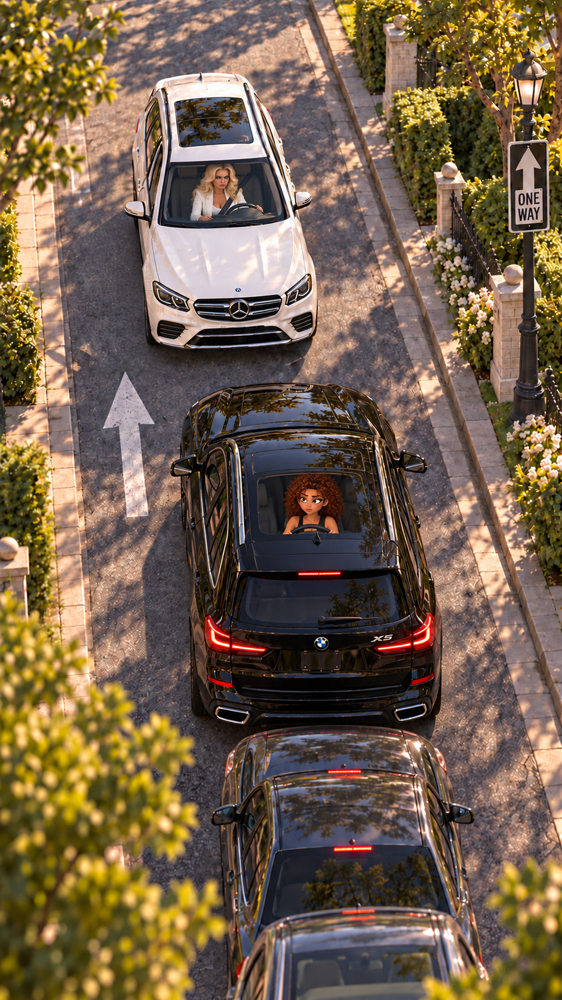

## 2. Блондинка требует дорогу

Блондинка остаётся за рулём Mercedes, выглядывает через открытое водительское окно и грубо машет рукой.

**Блондинка:** «Назад! Назад!»

**Фото 11 — рабочая версия:** сохранить эту расстановку машин. Перед анимацией проверить посадку Бимми: она должна сидеть в переднем левом кресле, а не в заднем боковом окне.

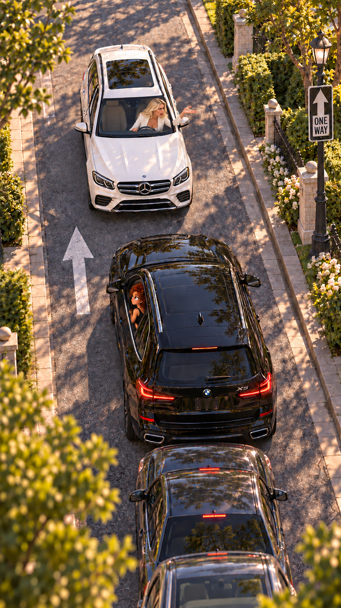

## 3. Бимми объясняет направление

Бимми показывает на знак ONE WAY, затем на блондинку, затем на разрешённое направление движения. Молчит.

**Фото 06 — требует исправления:** направление жеста и стрелка знака не согласованы. Не переносить эту ошибку в видео.

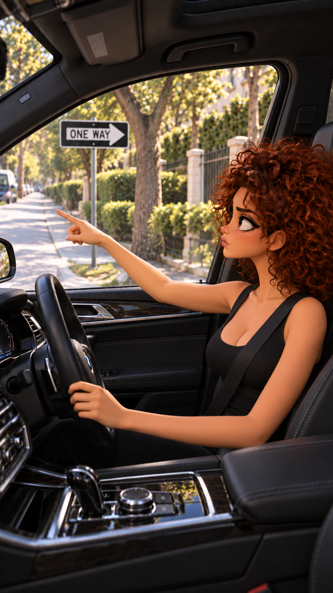

## 4. Повторное требование

Возвращаемся к блондинке в Mercedes. Она раздражённо повторяет жест.

**Блондинка:** «НАЗАД!»

Фото 11 повторяется как исходник другого монтажного момента; это не новая фотография.

## 5. Реакция Бимми

Несколько секунд молча смотрит на оппонентку, затем медленно крутит пальцем у виска.

**Звук:** BEEEEEP! BEEP! BEEEEEP!

**Фото 07:** реакция Бимми внутри BMW.

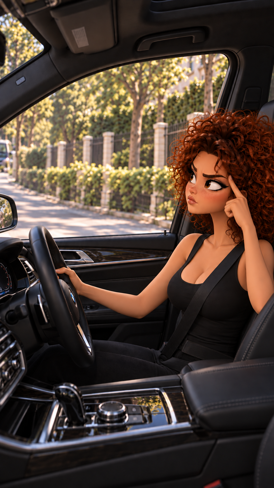

## 6. Куда назад?

Перебивка на длинную очередь за BMW. Затем Бимми разводит руками.

**Бимми:** «Куда назад?! Куда?!»

**Фотографии для жеста нет в репозитории.** Для очереди можно использовать фрагмент общего плана после исправления кадра 10.

## 7. Выход королевы

Блондинка закатывает глаза, поправляет волосы, открывает водительскую дверь Mercedes и выходит. В белых брюках и белом жакете идёт к водительскому окну BMW. Машины стоят на прежних местах.

Бимми следит за ней через лобовое стекло. Выражение лица передаёт мысль «Господи… она ещё и вышла…» — без озвучивания этой мысли.

**Фотографии нет в репозитории.** Нужен общий план сверху, показывающий водительскую дверь и путь блондинки.

## 8. Стук в закрытое стекло

Блондинка стоит снаружи у водительской двери BMW и стучит в закрытое стекло. Бимми сидит в переднем левом водительском кресле. Камера внутри со стороны переднего пассажира.

**Звук:** ТУК-ТУК-ТУК!

**Фото 09:** стук до открытия окна.

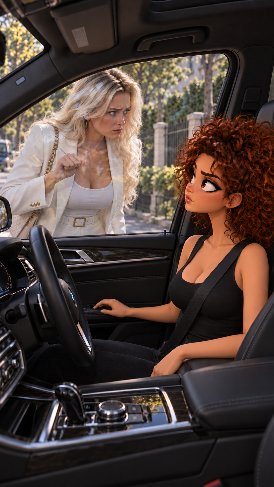

## 9. Бимми опускает окно

Бимми медленно опускает боковое стекло. Блондинка ждёт снаружи.

**Звук:** стеклоподъёмник. Без реплики.

**Фото 02:** переход с частично опущенным стеклом, а не отдельная сцена стука.

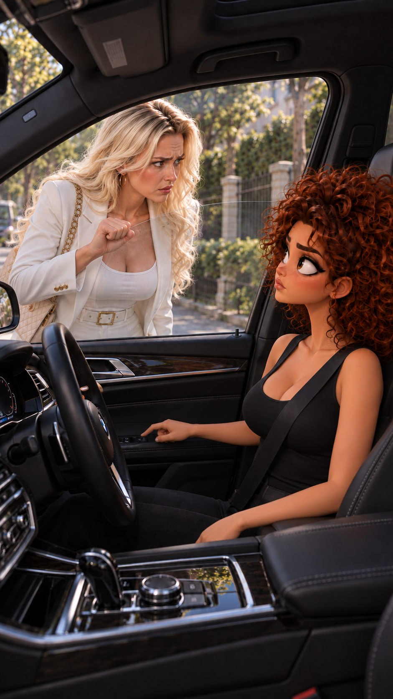

## 10. Ты знаешь, кто я?

Блондинка наклоняется к открытому водительскому окну. Бимми молчит и слушает.

**Блондинка, громко и высокомерно:** «Ты вообще знаешь, КТО Я?!»

Пауза.

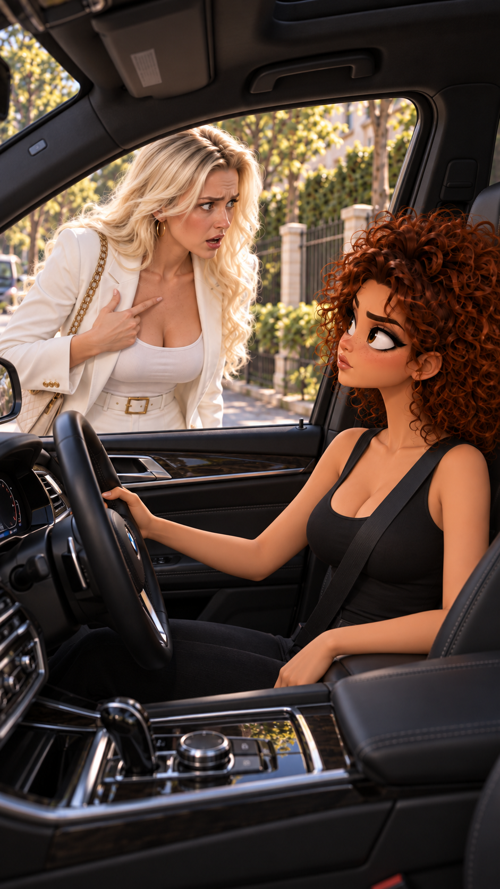

## 11. Неожиданный ответ

Бимми отвечает совершенно серьёзно, не подмигивая и не объясняя шутку заранее. Блондинка слушает молча.

**Бимми:** «Я жена Де Ниро.»

Пауза для реакции.

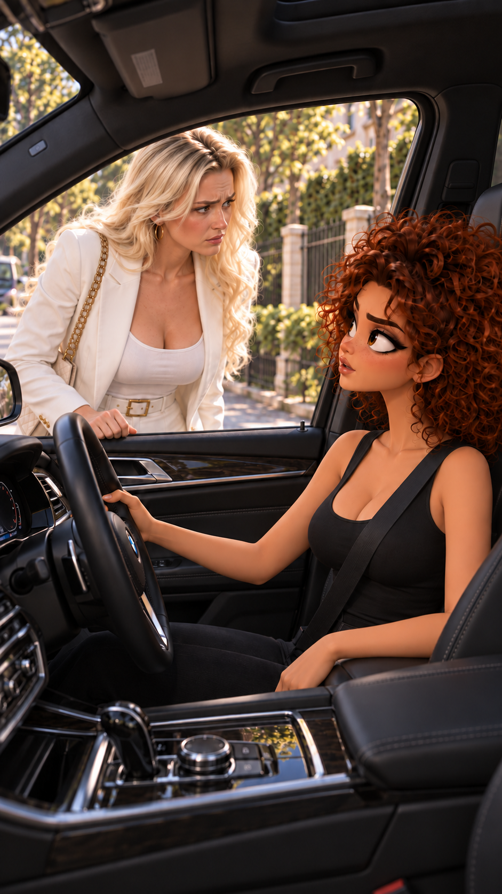

## 12. Чего?

Высокомерное выражение блондинки сменяется растерянностью.

**Блондинка:** «Чего?»

Бимми молчит. Фото 05 — исходник реакции блондинки.

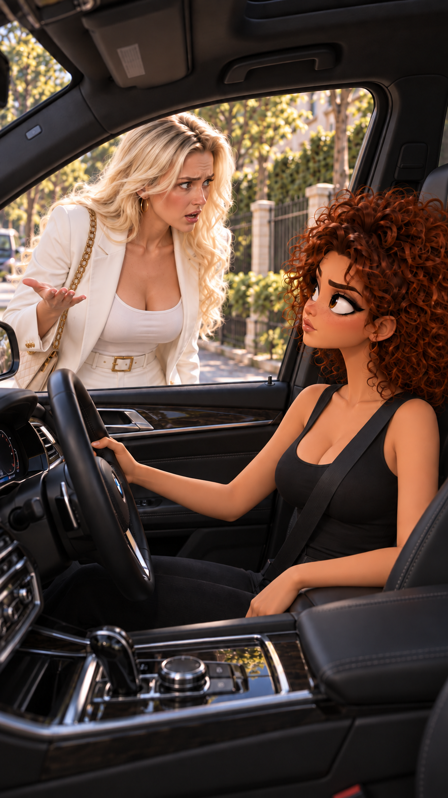

## 13. Повтор Бимми

Бимми ещё увереннее повторяет ответ с короткими паузами между словами. Блондинка не говорит.

**Бимми:** «Я. Жена. Де Ниро.»

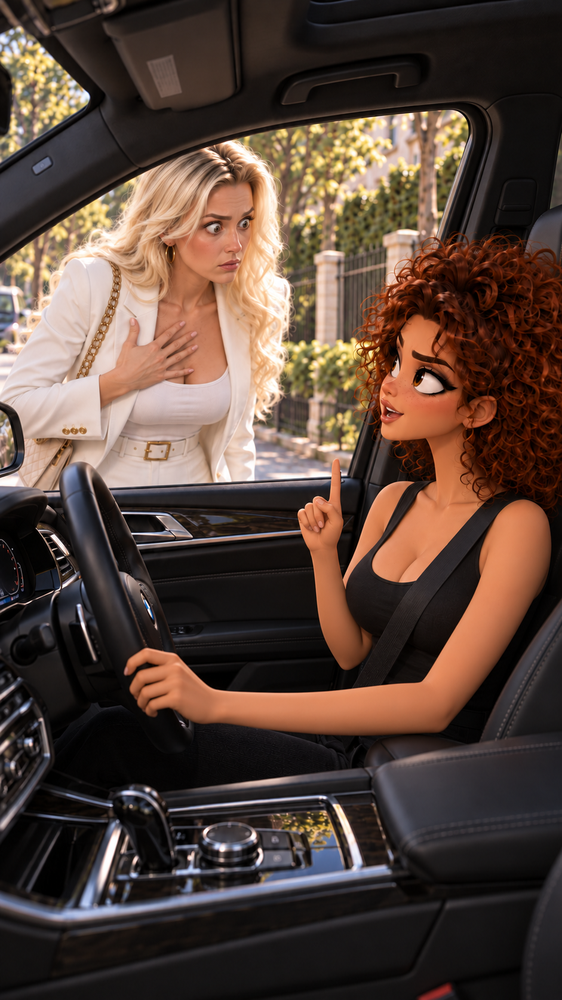

## 14. Я не знаю твоего мужа

Блондинка пытается понять ответ.

**Блондинка:** «Я не знаю твоего мужа…»

Пауза. Бимми слушает.

Фото 05 повторяется для второй реплики той же героини. В видео это отдельный речевой фрагмент.

## 15. Поэтому убирай машину

Бимми смотрит прямо на блондинку, затем указывает вперёд, на Mercedes.

**Бимми:** «А я не знаю, кто ТЫ!»

**Бимми:** «Поэтому убирай машину.»

**Звук сзади:** BEEEEEEP! BEEEEEEP!

Блондинка молчит.

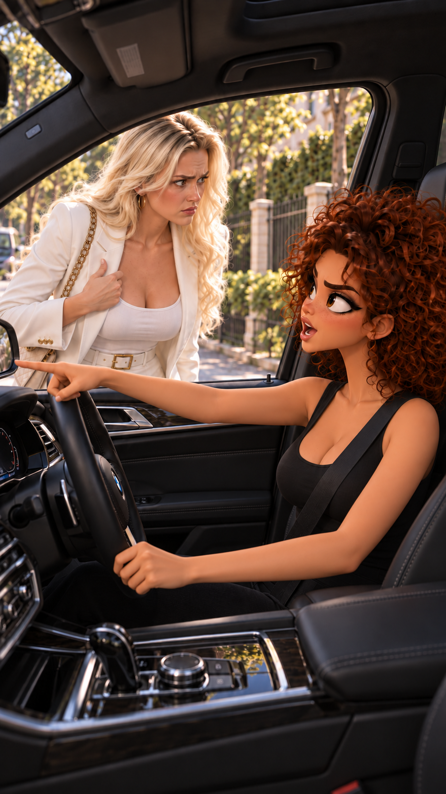

## 16. Блондинка уходит

Блондинка понимает, что ответить нечего. Раздражённо разворачивается и идёт обратно к Mercedes, расположенному перед BMW. Очередь остаётся за BMW.

**Диалог:** нет.

**Фотографии нет в репозитории.** Нужен кадр её ухода, не разговора у окна.

## 17. Последняя реплика Бимми

Блондинка уже отошла от окна. Бимми смотрит ей вслед и тихо говорит себе под нос.

**Бимми:** «Овца силиконовая…»

Затем поднимает стекло. Включает музыку, поправляет волосы и ждёт.

**Фотографии нет в репозитории.** Не использовать диалоговый кадр с блондинкой, всё ещё стоящей у окна.

## 18. Mercedes освобождает проезд

Блондинка возвращается за руль, закрывает водительскую дверь. Mercedes сдаёт назад и освобождает путь. BMW остаётся на месте до завершения манёвра.

**Звук:** двигатель, негромкая забавная музыка. Реплик нет.

**Фотографии нет в репозитории.** Нужен понятный общий план манёвра; машины не должны внезапно меняться местами.

## 19. Бимми уезжает

Пока стоит, Бимми надевает солнечные очки и делает музыку громче. Дорога свободна. Бимми берётся за руль и трогается с довольным, невозмутимым выражением лица.

Финальная камера — снаружи, через ЛОБОВОЕ стекло. Руль непосредственно перед водителем, правильная геометрия салона. Очередь начинает двигаться вслед за BMW.

**Реплик нет.** Забавная музыка становится громче.

**Финальная надпись:** «BIMMY — жена Де Ниро 😂»

**Фотографии нет в репозитории.** Не заменять общим планом остановившихся машин.

